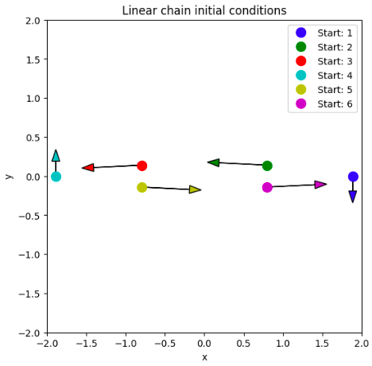
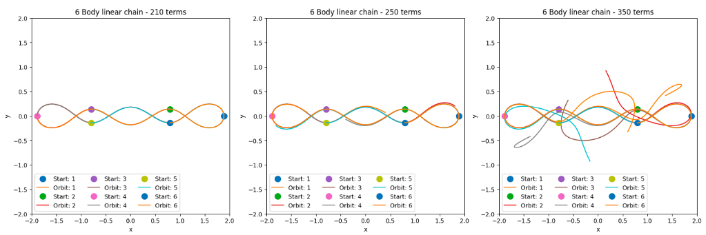
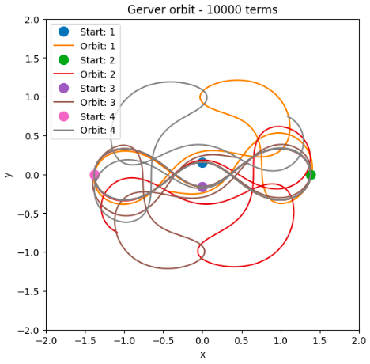

# Computational Physics: Complex Orbital Dynamics

## 2023

### Project Overview

This project focuses on the solutions and simulations of orbital motion for bodies under the influence of gravity using various computational techniques. The study explores both idealized and realistic problems, examining the stability, accuracy, and conservation of energy and angular momentum for objects of the same mass.

## Background

The project investigates stable orbital solutions for 2 to 8 bodies under the classical Newtonian gravity regime, with some solutions extendable to any number of bodies. The computational techniques used include:

- **Euler's Method**
- **Velocity Verlet Integration**
- **Runge Kutta 4th Order** (using SciPy's `integrate.solve_ivp` with method `RK45` and a relative tolerance of 1e-6)

The orbital scenarios considered include:

- **2 bodies with a fixed central mass**
- **2 bodies with a movable central mass**
- **3 bodies in a Sun-Earth-Moon-like system**
- **N bodies in circular orbit**
- **N bodies in a linear chain**
- **Complex choreographies of 3 bodies**

For all orbit types, the study examines stability and sensitivity to initial conditions. The gravitational constant $G$ is set to 1 to simplify the differential equations and enhance numerical convergence.

## A Few Example Graphs Prdocued in Simulation

## Newtonian Gravity and Differential Equations

The project uses Newtonian gravity, a classical representation of orbits, ignoring relativistic effects. Despite this, it provides a useful approximation for simulating the orbits of interest.

### Equation of Motion

The force on a body (1) due to another body (2) is given by:

$$
F_{12} = \frac{Gm_1m_2}{|r_{21}|^3}r_{21}
$$

Using Newton's third law and second law, the equation of motion for object 1 becomes:

$$
\frac{d^2r_1}{dt^2} = Gm_2 \left( \frac{r_{21}}{|r_{21}|^3} \right)
$$

This equation can be extended to $N$ bodies by summing their forces.

### Energy and Angular Momentum

The project also calculates the kinetic energy (KE), potential energy (PE), and angular momentum (L) using:

- $KE = \frac{1}{2} mv^2$
- $PE = -\frac{GMm}{r}$
- $L = m(v \times r)$

## Euler's Method

### Method and Equations

Euler's method, a simple approach to solving differential equations, is implemented but is prone to instabilities and inaccuracies. The method is based on:

$$
y(t + \Delta t) = y(t) + \Delta t \frac{dy(t)}{dt}
$$

For second-order differential equations, position $r$ and velocity $v$ are updated at each time step:

$$
r(t + \Delta t) = r(t) + \Delta t \cdot \frac{dr(t)}{dt}
$$

$$
v(t + \Delta t) = v(t) + \Delta t \cdot \frac{dv(t)}{dt}
$$

### Implementation

Euler's method was tested by simulating the orbit of a planet around a fixed central mass, where the outer mass spirals outward over time due to inaccuracies in the method.

### Inaccuracies and Analysis

The inaccuracies stem from the finite difference approximation, leading to linear increases in energy and angular momentum, which are compounded in more complex dynamics. The global error is of order $\Delta t$.

## The Velocity Verlet Method

### Overview

Velocity Verlet is a more accurate, time-reversible method, conserving energy and angular momentum better than Euler's method. The global error is of order $(\Delta t)^2$.

### Equations and Implementation

The equations for Velocity Verlet are:

$$
r(t + \Delta t) = r(t) + \Delta t \cdot v(t) + \frac{\Delta t^2}{2m} \cdot F(t)
$$

$$
v(t + \Delta t) = v(t) + \frac{\Delta t}{2m} \cdot \left[ F(t) + F(t + \Delta t) \right]
$$

This method was tested on a two-body system with similar masses, resulting in a more stable and accurate simulation compared to Euler's method.

### Analysis and Comparison

While Velocity Verlet is more accurate, it is computationally more expensive. The energy oscillations observed were much smaller than with Euler's method, confirming better stability and conservation properties.

## The Three-Body Problem

### Overview

The three-body problem is analytically unsolvable but can be studied numerically. The project explores the Star-Planet-Moon (S-P-M) system using both Velocity Verlet and Runge Kutta 4th order.

### Runge Kutta Method

Runge Kutta 4th order, implemented using SciPy's `solve_ivp`, offers a lower global error $(\Delta t)^4$ but does not conserve energy as well as Velocity Verlet. The method was tested on the S-P-M system.

### Energy and Angular Momentum Analysis

While the Runge Kutta method produced similar orbital paths to Velocity Verlet, it showed different energy and angular momentum behavior due to its lack of time reversibility.

### Eccentricity of Body 3

The Laplace-Runge-Lenz-Pauli vector was used to analyze the eccentricity of body 3's orbit, showing similar results for both Verlet and Runge-Kutta methods, indicating accurate motion despite differences in energy conservation.

## N-Body Choreographies

### Overview

The project explores N-body choreographies, focusing on the stability and sensitivity of circular orbits for 3 to 8 bodies, as well as linear chain choreographies.

### Circular Orbits and Stability

Stable circular orbits were found for 3 to 8 bodies, but the stability decreased with more bodies, as seen in the 9-body simulation. The orbits' sensitivity to initial conditions and solver precision was noted.

### Linear Chain Choreography

The linear chain choreography, specifically the Gerver SuperEight for 4 and 6 bodies, was simulated. While initially stable, the choreography became unstable over time, highlighting the sensitivity to accumulated numerical errors.

## Conclusion

The project demonstrates the application of various computational techniques to solve complex orbital dynamics problems. While simpler methods like Euler's have significant limitations, more advanced methods like Velocity Verlet and Runge Kutta offer improved accuracy and stability. The exploration of N-body choreographies and the three-body problem illustrates the challenges and intricacies of simulating gravitational systems.

## References

1. Newton, Isaac. *Philosophiæ Naturalis Principia Mathematica*. 1687.
2. V´ıctor S´anchez Li˜n´an, *A generalization of Lagrange's solution to the N-body problem*. 2017.
3. SciPy Documentation: https://docs.scipy.org/doc/scipy/reference/generated/scipy.integrate.solve_ivp.html
4. Goldstein, Herbert. *Classical Mechanics*. 1950.
